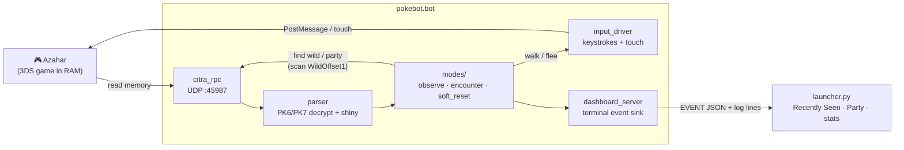

<p align="center">
  
</p>

<h1 align="center">pokebot-3ds</h1>

Automation tool for the Generation 6 and Generation 7 mainline Pokémon
games (X, Y, Omega Ruby, Alpha Sapphire, Sun, Moon, Ultra Sun, Ultra
Moon), running on the [Azahar](https://github.com/azahar-emu/azahar)
3DS emulator (the active fork of Citra).

It reads game memory directly over Azahar's UDP RPC, decrypts and
parses PK6/PK7 Pokémon records (shininess, IVs, nature, ability,
moves), and drives the game with simulated keyboard input.

This is a 3DS-era counterpart to
[wyanido/pokebot-nds](https://github.com/wyanido/pokebot-nds), built
from the same architectural ideas (parser → memory access → dashboard)
but adapted to Azahar's UDP RPC instead of an in-emulator Lua console.

> **Disclaimer.** This is a fan project not affiliated with or endorsed
> by Nintendo, Game Freak, or The Pokémon Company. Use it only with
> games and emulator copies you legally own. No ROMs, save files, or
> game assets are distributed with this repository.

## Features

- **Three bot modes:**
  - `observe` — passive read-only; mirrors party + foe to the launcher's Recently Seen tab
  - `encounter` — walks in grass, records each foe, flees on miss until target hit
  - `soft_reset` — for starters / legendaries / gifts (mash A, evaluate, L+R+Start, repeat)
- **Starter hunting** — pick the specific Gen 6/7 starter (Chespin, Fennekin, Froakie, etc.) and the bot resets until you get the right species — combine with shiny/IV target rules to hunt a specific shiny starter
- **Target system** — filter by shininess, IVs, nature, gender, species, or ability; combine rules with AND/OR
- **GUI launcher** ([launcher.py](launcher.py)) — auto-installs deps, **live-detects Azahar and your loaded game**, picks game/mode/starter
- **Terminal output** — each encounter is printed as a readable line in the launcher's log tab (and stdout when running the bot directly)
- **No offset hunting (X/Y)** — addresses ship in `config.yaml`; detection scans the live opponent/party region automatically (PKMN-NTR map)
- **PK6/PK7 parser** — full block decryption + shuffle, checksum verification

> **Step-by-step walkthrough:** see [docs/TUTORIAL.md](docs/TUTORIAL.md)
> for a full first-time setup + soft-reset starter hunt.

## Status — what works

Detection no longer relies on fragile pointer chains: it scans the
PKMN-NTR `WildOffset1` region for the live opponent and reads the
party at `PartyOffset`, decrypting PK6 in-place. **Pokémon Y has been
verified end-to-end on Azahar** (every wild encounter caught, correct
species/level/IVs/nature/ability, shiny math live, auto-flee, stop +
alert on a target). The other Gen 6/7 titles use the same code path
with their published offsets but haven't been user-tested yet.

Legend: ✅ verified live · 🟡 wired, not yet user-tested · ⬜ planned

| Capability | X / Y | OR / AS | S / M | US / UM |
|---|:---:|:---:|:---:|:---:|
| Live wild detection (species · PID · IVs · nature · ability) | ✅ | 🟡¹ | 🟡² | 🟡² |
| Shiny detection (PSV vs player TSV) | ✅ | 🟡 | 🟡 | 🟡 |
| Random-encounter shiny hunt (walk → flee → stop on shiny) | ✅ | 🟡¹ | 🟡² | 🟡² |
| Manual / observe (read-only, no inputs) | ✅ | 🟡 | 🟡 | 🟡 |
| Live party read (Recently Seen + Party strip) | ✅ | 🟡 | 🟡 | 🟡 |
| Persistent Phase / Total / best SV / best IVs | ✅ | ✅ | ✅ | ✅ |
| Soft-reset (starters · gifts · legendaries) | 🟡 | 🟡 | 🟡 | 🟡 |
| PKHeX LiveHeX bridge (box / trainer editing) | ✅ | 🟡 | ⬜³ | ⬜³ |

| Additional features | Status |
|---|:---:|
| Auto-flee non-targets | ✅ |
| Stop + loud alert on shiny / target | ✅ |
| Ability names (not IDs) | ✅ |
| Animated species sprites in the launcher | ✅ |
| Target filter (shiny / IVs / nature / gender / species / ability) | ✅ |
| Auto-catch on target | ⬜ |
| Fishing / egg-hatching / SOS chains | ⬜ |

¹ OR/AS shares X/Y's `WildOffset1 = 0x08800000`; same code path,
not yet user-tested. ² S/M & US/UM offsets are taken from PKMN-NTR's
`LookupTable.cs` and wired in but unverified on Azahar. ³ The
NTR↔Azahar LiveHeX bridge is implemented for Gen 6; Gen 7 untested.

**Good to run today:** Pokémon X/Y random-encounter shiny hunting —
start it in tall grass and it walks, detects every encounter, flees
non-targets, and stops with an alert (battle left on screen) when a
shiny appears, tracking your phase/total across sessions.

## Download

Every push to `main` rebuilds a rolling "latest" release. The download
URL never changes — it always points at the most recent commit:

**[Download the latest build →](https://github.com/romanrdecaro-arch/pokebot-3ds/releases/latest/download/pokebot-3ds.zip)**

Or browse the [Releases page](https://github.com/romanrdecaro-arch/pokebot-3ds/releases)
to grab a specific commit.

If you'd rather use git directly:
```
git clone https://github.com/romanrdecaro-arch/pokebot-3ds.git
```

## Quick start

1. **Install Azahar** and load your Gen 6/7 game. Make sure
   *Emulation → Configure → General → Enable scripting* is on.

2. **Launch the GUI:**
   - **Windows:** double-click `pokebot-3ds.bat` (or run it from a terminal).
   - **macOS / Linux / any platform:** `python launcher.py`

   (Python 3.10+ recommended. The launcher auto-installs `PyYAML` and
   `pynput` if missing.)

3. **Pick a mode and start.** For **Pokémon X/Y** the offsets ship in
   [config.yaml](config.yaml) — nothing to find. Pick *Random
   encounters* (or *Manual control*), click *Start Bot*, and watch
   the Recently Seen tab fill as the bot detects wild Pokémon. (Other
   Gen 6/7 titles use the same wired offsets — see
   [Status](#status--what-works).)

## Manual / CLI usage

If you'd rather skip the GUI:

```
pip install -r requirements.txt
# config.yaml ships X/Y offsets; just set mode + target
python run.py
# encounters print to stdout as they happen
```

## Architecture



## Modes

| Mode         | What it does                                    | Needs offsets             |
|--------------|-------------------------------------------------|---------------------------|
| `observe`    | Passive read-only; reports party + foe changes | `party_base`, `foe_base`  |
| `encounter`  | Walks in grass, evaluates each foe vs. target  | `foe_base`, `in_battle_flag` |
| `soft_reset` | Starters / legendaries / gifts                 | `party_base`              |

## Targets

Build a target from any combination of these rules in `config.yaml`:

- `shiny: true / false`
- `nature: [Adamant, Jolly, ...]`
- `gender: [M, F, G]`
- `species: [25, 133, ...]`        (national-dex IDs)
- `iv_min: {Atk: 31, Spe: 31}`
- `iv_exact: {HP: 31}`
- `iv_sum_min: 150`
- `perfect_iv_count_min: 5`
- `ability_num: [1, 2, 4]`         (4 = hidden)

Combine with `mode: all` (AND) or `mode: any` (OR).

## Offsets

For **Pokémon X/Y the offsets ship in `config.yaml`** already — no
setup needed. Detection scans the `WildOffset1` region for the live
opponent and reads the party at `PartyOffset` (the PKMN-NTR address
map), so you don't hand-find anything. The other Gen 6/7 titles have
their offsets wired from the same map (see [Status](#status--what-works)).

## Shiny-locked Pokémon

Some Gen 6/7 Pokémon are **shiny-locked** — the game forces their PID
to a non-shiny value, so no amount of soft-resetting will produce a
shiny one. Hunting these is a waste of time. The launcher's method
dropdown flags these with a ⚠ warning before you start the bot, but
here's the canonical list (source:
[serebii.net/games/shiny.shtml](https://www.serebii.net/games/shiny.shtml)):

### Pokémon X / Y
- Xerneas (X) / Yveltal (Y)
- Zygarde (Terminus Cave)
- Mewtwo (Unknown Dungeon)
- Articuno / Zapdos / Moltres (roaming)
- Eternal Flower Floette (event-tied; never officially released)

### Pokémon Omega Ruby / Alpha Sapphire
- Groudon (Omega Ruby) / Kyogre (Alpha Sapphire)
- Rayquaza (Delta Episode)
- Latios / Latias (Southern Island + opposite-version gift)
- Sky Pillar / DexNav-related event Pokémon
- Mythical Pokémon distributed via download codes (Deoxys, Hoopa,
  Volcanion, etc.)

### Pokémon Sun / Moon
- Solgaleo (Sun) / Lunala (Moon)
- Cosmog (gift, evolves into Solgaleo/Lunala)
- The four Tapu guardians (Koko, Lele, Bulu, Fini)
- Type: Null (gift) and Silvally
- Necrozma
- All Ultra Beasts on first encounter (Nihilego, Buzzwole, Pheromosa,
  Xurkitree, Celesteela, Kartana, Guzzlord)
- Magearna (event-tied)
- Marshadow (event-tied)
- Zygarde cells/cores collected for Reassembly Unit

### Pokémon Ultra Sun / Ultra Moon
- Solgaleo (Ultra Sun) / Lunala (Ultra Moon)
- Cosmog (gift)
- The four Tapu guardians
- Type: Null (gift)
- Necrozma (in all forms tied to the main story)
- Most Ultra Beasts encountered through the main story (Stakataka,
  Blacephalon, etc.)
- Zeraora (event-tied)
- Magearna (event-tied)
- **Exception:** Ultra Beasts and the legendary trio (Mewtwo,
  Lugia/Ho-Oh, Tornadus/Thundurus/Landorus, etc.) caught via
  **Ultra Wormhole** are **NOT shiny-locked** — these are valid
  shiny-hunting targets.

If a Pokémon you want to hunt isn't on this list, it's free game.
Always cross-reference Serebii or PKHeX research before sinking
hours into a hunt — Game Freak occasionally patches in or removes
shiny locks between game versions.

## Roadmap

- **More modes:** fishing, hatching, SOS chains (Gen 7), Wormhole (USUM), Friend Safari (XY), Hidden Grottos (XY/ORAS)
- **Per-version offset tables** for EUR, JPN, and earlier patch revisions
- **Box reads** — parser already handles 232-byte box records; needs box base address
- **Per-game menu navigation** — encounter mode's "press B to flee" is generic; some games need specific sequences

## Layout

```
pokebot-3ds/
├── README.md
├── LICENSE
├── requirements.txt
├── run.py                    ← CLI entry point
├── launcher.py               ← GUI entry point
├── pokebot-3ds.bat           ← Windows double-click launcher
├── config.yaml               ← user config
├── pokebot/
│   ├── parser.py             ← PK6/PK7 decrypt + parse
│   ├── citra_rpc.py          ← Azahar UDP client
│   ├── games.py              ← per-game offset registry
│   ├── targets.py            ← filter logic
│   ├── input_driver.py       ← pynput-based keyboard driver
│   ├── dashboard_server.py   ← terminal event sink (encounter lines + EVENT JSON)
│   ├── find_offsets.py       ← memory scanner utility
│   ├── bot.py                ← orchestrator
│   └── modes/
│       ├── observe.py
│       ├── encounter.py
│       └── soft_reset.py
```

## Credits & references

**Detection (the core of this project) is built directly on prior
reverse-engineering work — credit to those authors:**

- **[PKMN-NTR](https://github.com/drgoku282/PKMN-NTR) by drgoku282**
  (and the earlier **[fa-dx/PKMN-NTR](https://github.com/fa-dx/PKMN-NTR)**)
  — its `Helpers/LookupTable.cs` (`WildOffset1`, `PartyOffset`,
  `TrainerCardOffset`, `BoxOffset` per game) and the
  `ReadOpponent`/`HandleOpponentData` strategy ARE the basis for this
  project's live Gen 6/7 RAM detection. Without this map the live
  detection would not exist.
- **[PKHeX-Plugins](https://github.com/architdate/PKHeX-Plugins)** by
  architdate & the Project Pokémon team — LiveHeX `RamOffsets` and the
  NTR protocol, the reference for the NTR↔Azahar bridge and the X/Y
  save-block addresses.
- **[PKHeX](https://github.com/kwsch/PKHeX) by Kurt (kwsch)** — the
  PK6 format, the `G6PKM` shiny/validity rules (`Sanity == 0 &&
  checksum`, PSV/TSV), and the `Ability` enum used for ability names.
- [Project Pokémon](https://projectpokemon.org/) — Gen 6/7 PKM
  structure docs, the X/Y RAM threads, and the cheat/AR-code research
  that pointed at the right regions.

**Project lineage & tooling:**

- [pokebot-nds](https://github.com/wyanido/pokebot-nds) by wyanido — the architectural template this project follows.
- [pokebot-gen3](https://github.com/40Cakes/pokebot-gen3) by 40Cakes — the inspiration for this project.
- [Azahar](https://github.com/azahar-emu/azahar) — the emulator and the bundled `dist/scripting/citra.py` that this project's RPC client is modeled on.
- [PokeAPI/sprites](https://github.com/PokeAPI/sprites) and [Pokémon Showdown](https://play.pokemonshowdown.com/) — the species sprites shown in the launcher.

## License

MIT — see [LICENSE](LICENSE).
