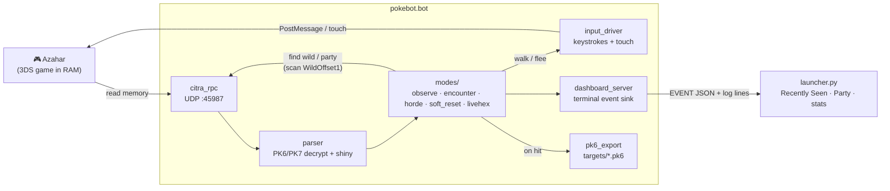

<p align="center">
  
</p>

<h1 align="center">pokebot-3ds</h1>

<p align="center">
  <em>Shiny-hunting automation for Gen 6/7 Pokémon games on the
  <a href="https://github.com/azahar-emu/azahar">Azahar</a> 3DS emulator.</em>
</p>

<p align="center">
  <a href="https://github.com/romanrdecaro-arch/pokebot-3ds/releases/latest/download/pokebot-3ds.zip"></a>
  <a href="docs/TUTORIAL.md"></a>
  <a href="LICENSE"></a>
</p>

pokebot-3ds reads game memory directly over Azahar's UDP RPC, decrypts
and parses PK6/PK7 records (shininess, IVs, nature, ability, moves),
and drives the game with simulated input. Shiny hits are saved as
PKHeX-compatible `.pk6` files automatically.

> **Disclaimer.** Fan project, not affiliated with or endorsed by
> Nintendo, Game Freak, or The Pokémon Company. Use only with games
> and emulator copies you legally own. No ROMs, saves, or game assets
> are distributed here.

## Quick start

1. **Install [Azahar](https://github.com/azahar-emu/azahar)** and load
   your Gen 6/7 game. Make sure *Emulation → Configure → General →
   Enable scripting* is on.

2. **Get pokebot-3ds.** Either grab the
   [latest build](https://github.com/romanrdecaro-arch/pokebot-3ds/releases/latest/download/pokebot-3ds.zip)
   (rebuilt on every push to `main`) or clone:
   ```
   git clone https://github.com/romanrdecaro-arch/pokebot-3ds.git
   ```

3. **Launch the GUI:**
   - **Windows:** double-click `pokebot-3ds.bat`
   - **macOS / Linux:** `python launcher.py`

   Python 3.10+ recommended; the launcher auto-installs missing deps.

4. **Pick a mode and start.** Offsets for **Pokémon X/Y** ship in
   [config.yaml](config.yaml) — nothing to find. Other Gen 6/7 titles
   use the same wired offsets (see [Status](#status)).

For a full first-time walkthrough including soft-resetting starters,
see **[docs/TUTORIAL.md](docs/TUTORIAL.md)**.

## Features

- **Five bot modes** — `observe`, `encounter`, `horde`, `soft_reset`,
  `livehex` (see [Modes](#modes))
- **Target system** — filter by shininess, IVs, nature, gender,
  species, or ability; combine rules with AND/OR
- **PKHeX-compatible export** — every shiny / target hit is saved as
  a `.pk6` file in `targets/`, ready to drop straight into PKHeX
- **GUI launcher** ([launcher.py](launcher.py)) — auto-installs deps,
  live-detects Azahar + your loaded game, animated party + Recently
  Seen tab, persistent phase / total / best-SV / best-IV stats
- **Shiny-lock awareness** — the launcher's method dropdown flags
  shiny-locked starters / legendaries before you waste hours on them
  (full list: [docs/SHINY_LOCKED.md](docs/SHINY_LOCKED.md))
- **No offset hunting (X/Y)** — addresses are content-located in the
  live opponent / party regions automatically, relocation-proof
- **LiveHeX bridge** — Gen 6 box / trainer-card editing via PKHeX

## Status

Detection is built on PKMN-NTR's published RAM map, but uses
content-based scanning (checksum-valid PK6 in the `WildOffset1` /
`PartyOffset` regions) rather than fixed pointer chains — so it's
robust to Azahar's address relocation. **Pokémon Y has been verified
end-to-end on Azahar**; other Gen 6/7 titles share the same code path
with their published offsets but haven't been user-tested yet.

Legend: ✅ verified live · 🟡 wired, not yet user-tested · ⬜ planned

| Capability | X / Y | OR / AS | S / M | US / UM |
|---|:---:|:---:|:---:|:---:|
| Live wild detection (species · PID · IVs · nature · ability) | ✅ | 🟡¹ | 🟡² | 🟡² |
| Shiny detection (PSV vs player TSV) | ✅ | 🟡 | 🟡 | 🟡 |
| Random-encounter shiny hunt (walk → flee → stop on shiny) | ✅ | 🟡¹ | 🟡² | 🟡² |
| Horde encounters (5× multi-mon eval per battle) | ✅ | 🟡¹ | — | — |
| Manual / observe (read-only, no inputs) | ✅ | 🟡 | 🟡 | 🟡 |
| Live party read (Recently Seen + Party strip) | ✅ | 🟡 | 🟡 | 🟡 |
| Soft-reset (starters · gifts · legendaries) | ✅ | 🟡 | 🟡 | 🟡 |
| `.pk6` export of hit targets | ✅ | ✅ | ✅ | ✅ |
| Persistent Phase / Total / best SV / best IVs | ✅ | ✅ | ✅ | ✅ |
| PKHeX LiveHeX bridge (box / trainer editing) | ✅ | 🟡 | ⬜³ | ⬜³ |

¹ OR/AS shares X/Y's `WildOffset1 = 0x08800000`; same code path,
not yet user-tested. ² S/M & US/UM offsets are taken from PKMN-NTR's
`LookupTable.cs` and wired in but unverified on Azahar. ³ The
NTR↔Azahar LiveHeX bridge is implemented for Gen 6; Gen 7 untested.

**Good to run today:** Pokémon X/Y random-encounter and horde shiny
hunting, plus soft-resetting any of the three X/Y starters (Chespin /
Fennekin / Froakie).

## Modes

| Mode         | What it does                                                       |
|--------------|--------------------------------------------------------------------|
| `observe`    | Passive read-only; reports party + foe changes as you play         |
| `encounter`  | Walks in grass, evaluates each foe vs. target, flees on miss       |
| `horde`      | Same as encounter, but reports all 5 wilds per battle              |
| `soft_reset` | Starters / legendaries / gifts — sequence, evaluate, L+R+Start     |
| `livehex`    | Bridges Azahar to PKHeX for live box / trainer editing             |

## Targets

Build a target from any combination of these rules in `config.yaml`:

- `shiny: true / false`
- `nature: [Adamant, Jolly, ...]`
- `gender: [M, F, G]`
- `species: [25, 133, ...]` *(national-dex IDs)*
- `iv_min: {Atk: 31, Spe: 31}`
- `iv_exact: {HP: 31}`
- `iv_sum_min: 150`
- `perfect_iv_count_min: 5`
- `ability_num: [1, 2, 4]` *(4 = hidden)*

Combine with `mode: all` (AND) or `mode: any` (OR).

## CLI usage

If you'd rather skip the GUI:

```
pip install -r requirements.txt
# config.yaml ships X/Y offsets; just set mode + target
python run.py
```

Encounters print to stdout as they happen.

## Architecture

<details>
<summary>Data flow (click to expand)</summary>



</details>

## Credits & references

Detection is built directly on prior reverse-engineering work — credit
to those authors:

- **[PKMN-NTR](https://github.com/drgoku282/PKMN-NTR)** by drgoku282
  (and the earlier
  **[fa-dx/PKMN-NTR](https://github.com/fa-dx/PKMN-NTR)**) —
  `Helpers/LookupTable.cs` (`WildOffset1`, `PartyOffset`,
  `TrainerCardOffset`, `BoxOffset` per game) and the
  `ReadOpponent` / `HandleOpponentData` strategy ARE the basis for
  this project's Gen 6/7 RAM detection.
- **[PKHeX-Plugins](https://github.com/architdate/PKHeX-Plugins)** by
  architdate & the Project Pokémon team — LiveHeX `RamOffsets`, the
  NTR protocol, and the X/Y save-block addresses.
- **[PKHeX](https://github.com/kwsch/PKHeX)** by Kurt (kwsch) — the
  PK6 format, the `G6PKM` shiny/validity rules (`Sanity == 0 &&
  checksum`, PSV/TSV), and the `Ability` enum.
- **[Project Pokémon](https://projectpokemon.org/)** — Gen 6/7 PKM
  structure docs and the X/Y RAM threads.

Project lineage & tooling:

- **[pokebot-nds](https://github.com/wyanido/pokebot-nds)** by
  wyanido — the architectural template this project follows.
- **[pokebot-gen3](https://github.com/40Cakes/pokebot-gen3)** by
  40Cakes — the inspiration for this project.
- **[Azahar](https://github.com/azahar-emu/azahar)** — the emulator
  and bundled `dist/scripting/citra.py` that the RPC client is
  modeled on.
- **[PokeAPI/sprites](https://github.com/PokeAPI/sprites)** and
  **[Pokémon Showdown](https://play.pokemonshowdown.com/)** — species
  sprites shown in the launcher.

## License

MIT — see [LICENSE](LICENSE).
