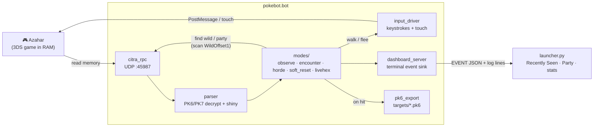

<p align="center">
  
</p>

<h1 align="center">pokebot-3ds</h1>

<p align="center">
  <em>Shiny-hunting automation for Gen 6/7 Pokémon games on the
  <a href="https://github.com/azahar-emu/azahar">Azahar</a> 3DS emulator.</em>
</p>

<p align="center">
  <a href="https://github.com/romanrdecaro-arch/pokebot-3ds/releases/latest/download/pokebot-3ds.zip"></a>
  <a href="docs/TUTORIAL.md"></a>
  <a href="LICENSE"></a>
</p>

pokebot-3ds reads game memory directly over Azahar's UDP RPC, decrypts
and parses PK6/PK7 records (shininess, IVs, nature, ability, moves),
and drives the game with simulated input. Shiny hits are saved as
PKHeX-compatible `.pk6` files automatically.

> **Disclaimer.** Fan project, not affiliated with or endorsed by
> Nintendo, Game Freak, or The Pokémon Company. Use only with games
> and emulator copies you legally own. No ROMs, saves, or game assets
> are distributed here.

## Requirements

pokebot-3ds is a thin client: it reads a few hundred bytes over
loopback UDP and posts keystrokes. **Azahar sets the hardware bar, not
the bot.** Measured footprint of the bot itself:

| | |
|---|---|
| Bot process | **21 MB** RSS |
| GUI launcher | **+30 MB** (Tk + Pillow) |
| Per encounter | ~6 reads, 302 bytes |
| Network | loopback UDP only — no internet needed |
| Disk | ~8 MB, plus Azahar and your own ROM |

### Software

- **OS** — Windows 10/11 (64-bit) is the fully supported target: input
  goes through `PostMessage`, so Azahar does **not** need to be the
  focused window and you can keep using your PC while it hunts.
  macOS and Linux work, but fall back to global key injection, which
  means Azahar must stay focused.
- **Python 3.10 or newer.** CI tests 3.10 and 3.12.
- **Tk** for the GUI launcher — bundled with the python.org installers;
  on Debian/Ubuntu `sudo apt install python3-tk`.
- **Azahar**, with:
  - *Emulation → Configure → **Debug** → Enable RPC server* — **on**
    (off by default; if the box is greyed out, close the running game
    first)
  - *Emulation → Configure → Debug → Use GDB stub* — **off**; it
    hijacks the same channel and the bot's requests get ignored
- **Dependencies install themselves** on first launch: `pynput` (input)
  and `PyYAML` (config). `Pillow` is optional — without it the launcher
  falls back to a drawn logo.

### Hardware

Reference machine that runs a hunt comfortably at 705% emulation speed,
with Azahar sitting at ~2.0 GB resident:

> Ryzen 7 5800X (8C/16T) · 32 GB RAM · RTX 4070 Ti

That is comfortably above what is needed. As a practical floor, aim for
a 64-bit quad-core, 8 GB of RAM, and a GPU with OpenGL 4.3 or Vulkan
support. Single-thread speed matters more than core count — 3DS
emulation does not spread across many cores, so a fast 4-core beats a
slow 16-core. Reset-hunt throughput is bound by how quickly Azahar can
replay the game's boot and intro, so CPU clock is the one spec that
directly buys you more attempts per hour.

### One emulator per machine

Azahar's RPC server is hardcoded to UDP port **45987** with no setting
to change it, and the port cannot be shared. A second Azahar on the
same PC starts with **no RPC at all** — and a second bot pointed at it
will silently connect to the *first* instance instead, driving one
window while reading another's memory. To hunt in parallel, use a
second machine.

## Quick start

1. **Install [Azahar](https://github.com/azahar-emu/azahar)** and load
   your Gen 6/7 game. Tick *Emulation → Configure → **Debug** → Enable
   RPC server* — it is **off by default**, and leaving it off is the
   single most common reason the launcher reports no emulator.

2. **Get pokebot-3ds.** Either grab the
   [latest build](https://github.com/romanrdecaro-arch/pokebot-3ds/releases/latest/download/pokebot-3ds.zip)
   (rebuilt on every push to `main`) or clone:
   ```
   git clone https://github.com/romanrdecaro-arch/pokebot-3ds.git
   ```

3. **Launch the GUI:**
   - **Windows:** double-click `pokebot-3ds.bat`
   - **macOS / Linux:** `python launcher.py`

   Python 3.10+ recommended; the launcher auto-installs missing deps.

4. **Pick a mode and start.** Offsets for **Pokémon X/Y** ship in
   [config.yaml](config.yaml) — nothing to find. Other Gen 6/7 titles
   use the same wired offsets (see [Status](#status)).

For a full first-time walkthrough including soft-resetting starters,
see **[docs/TUTORIAL.md](docs/TUTORIAL.md)**.

## Updating

You should only ever download pokebot-3ds once. The launcher checks
for a newer build when it opens and, if there is one, shows a bar with
an **Update now** button.

```
python run.py --check-update     # is there a newer build?
python run.py --update           # install it
```

It works for both kinds of install: a `git clone` fast-forwards with
`git pull --ff-only`, and a zip install downloads the current zip,
verifies its published SHA-256, and copies it over.

**What an update will not touch:**

| Kept | Why |
|---|---|
| `config.yaml` | your offsets, timings and target rules |
| `targets/` | every `.pk6` you have caught |
| `logs/` | encounter history |
| `.pokebot_stats*.json` | phase and lifetime counters |

Everything it *does* replace is copied to `.update-backup/<timestamp>/`
first, and the three most recent backups are kept. Nothing installs on
its own — the check is automatic, the install is a button press. To
stop it checking at all, set `updates.check_on_start: false` in
`config.yaml`.

A git checkout with uncommitted changes is left alone rather than
overwritten; commit or discard them and update again.

## Features

- **Five bot modes** — `observe`, `encounter`, `horde`, `soft_reset`,
  `livehex` (see [Modes](#modes))
- **Target system** — filter by shininess, IVs, nature, gender,
  species, or ability; combine rules with AND/OR
- **PKHeX-compatible export** — every shiny / target hit is saved as
  a `.pk6` file in `targets/`, ready to drop straight into PKHeX
- **GUI launcher** ([launcher.py](launcher.py)) — auto-installs deps,
  live-detects Azahar + your loaded game, animated party + Recently
  Seen tab, persistent phase / total / best-SV / best-IV stats
- **Shiny-lock awareness** — the launcher's method dropdown flags
  shiny-locked starters / legendaries before you waste hours on them
  (full list: [docs/SHINY_LOCKED.md](docs/SHINY_LOCKED.md))
- **No offset hunting (X/Y)** — addresses are content-located in the
  live opponent / party regions automatically, relocation-proof
- **LiveHeX bridge** — Gen 6 box / trainer-card editing via PKHeX

## Status

Detection is built on PKMN-NTR's published RAM map, but uses
content-based scanning (checksum-valid PK6 in the `WildOffset1` /
`PartyOffset` regions) rather than fixed pointer chains — so it's
robust to Azahar's address relocation. **Pokémon Y has been verified
end-to-end on Azahar**; other Gen 6/7 titles share the same code path
with their published offsets but haven't been user-tested yet.

Legend: ✅ verified live · 🟡 wired, not yet user-tested · ⬜ planned

| Capability | X / Y | OR / AS | S / M | US / UM |
|---|:---:|:---:|:---:|:---:|
| Live wild detection (species · PID · IVs · nature · ability) | ✅ | 🟡¹ | 🟡² | 🟡² |
| Shiny detection (PSV vs player TSV) | ✅ | 🟡 | 🟡 | 🟡 |
| Random-encounter shiny hunt (walk → flee → stop on shiny) | ✅ | 🟡¹ | 🟡² | 🟡² |
| Horde encounters (5× multi-mon eval per battle) | ✅ | 🟡¹ | — | — |
| Manual / observe (read-only, no inputs) | ✅ | 🟡 | 🟡 | 🟡 |
| Live party read (Recently Seen + Party strip) | ✅ | 🟡 | 🟡 | 🟡 |
| Soft-reset (starters · gifts · legendaries) | ✅ | 🟡 | 🟡 | 🟡 |
| `.pk6` export of hit targets | ✅ | ✅ | ✅ | ✅ |
| Persistent Phase / Total / best SV / best IVs | ✅ | ✅ | ✅ | ✅ |
| PKHeX LiveHeX bridge (box / trainer editing) | ✅ | 🟡 | ⬜³ | ⬜³ |

¹ OR/AS shares X/Y's `WildOffset1 = 0x08800000`; same code path,
not yet user-tested. ² S/M & US/UM offsets are taken from PKMN-NTR's
`LookupTable.cs` and wired in but unverified on Azahar. ³ The
NTR↔Azahar LiveHeX bridge is implemented for Gen 6; Gen 7 untested.

**Good to run today:** Pokémon X/Y random-encounter and horde shiny
hunting, plus soft-resetting any of the three X/Y starters (Chespin /
Fennekin / Froakie).

## Modes

| Mode         | What it does                                                       |
|--------------|--------------------------------------------------------------------|
| `observe`    | Passive read-only; reports party + foe changes as you play         |
| `encounter`  | Walks in grass, evaluates each foe vs. target, flees on miss       |
| `horde`      | Same as encounter, but reports all 5 wilds per battle              |
| `soft_reset` | Starters / legendaries / gifts — sequence, evaluate, L+R+Start     |
| `livehex`    | Bridges Azahar to PKHeX for live box / trainer editing             |

## Auto-catching

In `encounter` / `horde` mode the bot no longer just stops when it
finds a shiny — it catches it and keeps hunting. The sequence is the
same three touches you would make yourself:

**BAG → POKÉ BALLS → first slot in the pocket → A**, then a burst of
`B` presses to blast through "Gotcha!", the Pokédex entry and the
nickname prompt. (Touching the ball only selects it; the `A` is what
actually throws it.)

**Fleeing is fast, with a watchdog.** The flee sequence was tuned
against a 100% emulator and cost 12.7 s per encounter; Azahar runs this
hunt around 600%, where the same animations take about a sixth of that.
It is now ~4.8 s. Trimming that far risks the RUN touch landing before
the menu is drawn, which strands the bot in a battle it cannot see — so
`stuck_timeout` (default 60 s with no new encounter) re-sends the whole
flee sequence. Stalls are counted in the log so you can tell whether
your timings are too tight.

**A catch never ends the hunt.** With `catch_confirm: false`
(the shipped default) the bot throws, clears the text and goes straight
back to walking without reading the party at all — verification only
earns its keep when a ball can break out, and a Master Ball cannot.
If something really did go wrong, `stuck_timeout` notices within a
minute and fires the flee sequence. Turn `catch_confirm` on if you hunt
with balls that can fail; then an unverifiable catch (a full party
sends it to a PC box) resumes anyway unless you set
`on_catch_fail: stop`. Either way the `.pk6` is exported *before* the
ball is thrown, so the record survives regardless.

**Movement never stops for a battle.** A wild encounter used to be ~12
seconds of the bot standing still; those waits are now spent walking,
so the player is already back in the grass the instant the battle
releases. Movement stops the moment a shiny is found — from then on
nothing is nudging the battle-menu cursor while the catch runs.

Put the ball you want thrown in that first slot. A Master Ball catches
on the first attempt every time; anything else can break out, so the
sequence repeats (up to `catch_attempts`, default 5) until the catch is
**confirmed in your party** — read from game memory, not assumed from
timing. `B` is tapped throughout to clear "Gotcha!", the Pokédex entry
and the nickname prompt.

If the catch cannot be confirmed, the bot **stops with the battle still
open** rather than walking away from a shiny. It also stops immediately
if touch input isn't reaching Azahar, instead of throwing five balls at
a window that receives nothing.

Set `random_encounters.on_target: stop` to go back to the old behaviour.
Touch points are fractions of the 3DS touch screen (`bag_local`,
`balls_local`, `ball_local`), so they stay correct at any window size.

## Targets

Build a target from any combination of these rules in `config.yaml`:

- `shiny: true / false`
- `nature: [Adamant, Jolly, ...]`
- `gender: [M, F, G]`
- `species: [25, 133, ...]` *(national-dex IDs)*
- `iv_min: {Atk: 31, Spe: 31}`
- `iv_exact: {HP: 31}`
- `iv_sum_min: 150`
- `perfect_iv_count_min: 5`
- `ability_num: [1, 2, 4]` *(4 = hidden)*

Combine with `mode: all` (AND) or `mode: any` (OR).

## CLI usage

If you'd rather skip the GUI:

```
pip install -r requirements.txt
# config.yaml ships X/Y offsets; just set mode + target
python run.py
```

Encounters print to stdout as they happen.

## Architecture

<details>
<summary>Data flow (click to expand)</summary>


```mermaid
flowchart LR
    AZ["🎮 Azahar<br/>(3DS game in RAM)"]

    subgraph BOT["pokebot.bot"]
        RPC["citra_rpc<br/>UDP :45987"]
        PAR["parser<br/>PK6/PK7 decrypt + shiny"]
        MOD["modes/<br/>observe · encounter · horde · soft_reset · livehex"]
        INP["input_driver<br/>keystrokes + touch"]
        DASH["dashboard_server<br/>terminal event sink"]
        EXP["pk6_export<br/>targets/*.pk6"]
    end

    LAUNCH["launcher.py<br/>Recently Seen · Party · stats"]

    AZ -- "read memory" --> RPC
    RPC --> PAR
    PAR --> MOD
    MOD -- "find wild / party<br/>(scan WildOffset1)" --> RPC
    MOD -- "walk / flee" --> INP
    INP -- "PostMessage / touch" --> AZ
    MOD --> DASH
    MOD -- "on hit" --> EXP
    DASH -- "EVENT JSON + log lines" --> LAUNCH
```

</details>

## Credits & references

Detection is built directly on prior reverse-engineering work — credit
to those authors:

- **[PKMN-NTR](https://github.com/drgoku282/PKMN-NTR)** by drgoku282
  (and the earlier
  **[fa-dx/PKMN-NTR](https://github.com/fa-dx/PKMN-NTR)**) —
  `Helpers/LookupTable.cs` (`WildOffset1`, `PartyOffset`,
  `TrainerCardOffset`, `BoxOffset` per game) and the
  `ReadOpponent` / `HandleOpponentData` strategy ARE the basis for
  this project's Gen 6/7 RAM detection.
- **[PKHeX-Plugins](https://github.com/architdate/PKHeX-Plugins)** by
  architdate & the Project Pokémon team — LiveHeX `RamOffsets`, the
  NTR protocol, and the X/Y save-block addresses.
- **[PKHeX](https://github.com/kwsch/PKHeX)** by Kurt (kwsch) — the
  PK6 format, the `G6PKM` shiny/validity rules (`Sanity == 0 &&
  checksum`, PSV/TSV), and the `Ability` enum.
- **[Project Pokémon](https://projectpokemon.org/)** — Gen 6/7 PKM
  structure docs and the X/Y RAM threads.

Project lineage & tooling:

- **[pokebot-nds](https://github.com/wyanido/pokebot-nds)** by
  wyanido — the architectural template this project follows.
- **[pokebot-gen3](https://github.com/40Cakes/pokebot-gen3)** by
  40Cakes — the inspiration for this project.
- **[Azahar](https://github.com/azahar-emu/azahar)** — the emulator
  and bundled `dist/scripting/citra.py` that the RPC client is
  modeled on.
- **[PokeAPI/sprites](https://github.com/PokeAPI/sprites)** and
  **[Pokémon Showdown](https://play.pokemonshowdown.com/)** — species
  sprites shown in the launcher.

## License

MIT — see [LICENSE](LICENSE).
